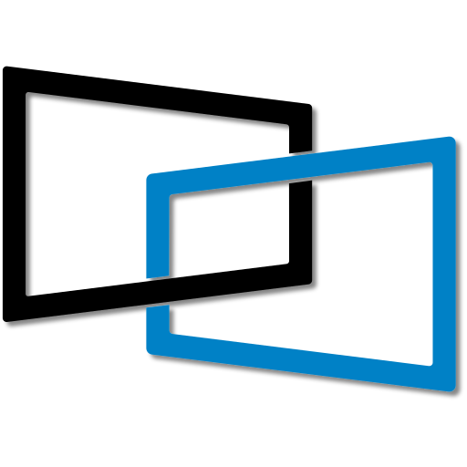

<p align="center">
  
</p>

<h1 align="center">DisplayLink Direct</h1>

<p align="center">
  Connect and drive multiple displays over USB using DisplayLink&reg; technology.
</p>

<p align="center">
  <a href="https://displaylink.github.io/displaylink-direct/"><strong>📖 Read the Documentation »</strong></a>
</p>

---

## Overview

**DisplayLink Direct** is an SDK that lets applications render content directly to
DisplayLink-connected displays. DisplayLink (developed by Synaptics) encodes and
transmits video over standard data buses, such as USB 2.0 and USB 3.x, without
relying on native video pass-through such as DisplayPort Alt Mode or Thunderbolt.

The SDK provides C/C++ headers and language bindings so you can integrate
multi-display output into your own applications.

## Features

- Drive multiple displays over a single USB connection.
- Use the C/C++ API or **Python** bindings.
- Render Qt applications to DisplayLink displays with the Qt platform plugin.
- Get started with ready-to-run samples, including a video wall and EDID reader.
- Deploy without host-side drivers or compositor integration, making the SDK
  suitable for embedded systems and other use cases that need a lightweight solution.
- Configure and integrate multi-display output quickly with the
  **simple, easy-to-use API**.

## Supported Platforms

| Platform | Architectures      |
| -------- | ------------------ |
| Linux    | `x86_64`, `aarch64` |
| Android  | `aarch64` |

## Documentation

Full documentation is hosted at:

### 👉 <https://displaylink.github.io/displaylink-direct/>

It covers installation, requirements, API reference, code samples, and
troubleshooting. To build and preview the docs locally:

```bash
python3 -m venv .venv && source .venv/bin/activate
pip install -r docs/requirements.txt
./docs/serve.sh
```

## Repository Structure

| Path            | Description                                             |
| --------------- | ------------------------------------------------------- |
| `include/`      | C/C++ header files for the SDK.                            |
| `libs/`         | Core library details (binaries are distributed as release assets). |
| `python/`       | Python bindings, distributed as `.whl` release assets.     |
| `samples/`      | Sample applications for C/C++ and Python.                  |
| `firmware/`     | Firmware update packages and instructions.                 |
| `docs/`         | Documentation source (MkDocs).                              |

### Component READMEs

For instructions specific to each area, see:

- [samples/README.md](samples/README.md) for instructions on building and running
  the sample applications.
- [libs/README.md](libs/README.md) for core library package details and dependencies.
- [firmware/README.md](firmware/README.md) for firmware update workflow and assets.

## License

The core libraries are **proprietary and closed source**, distributed as
pre-built binaries via GitHub Release Assets. See [LICENSE](LICENSE) for terms and
[NOTICE](NOTICE) for third-party notices.

## Contributing

Contributions to the documentation and samples are welcome — see
[CONTRIBUTING.md](CONTRIBUTING.md) for details.

## Security

To report a security vulnerability, please follow the process described in
[SECURITY.md](SECURITY.md).
