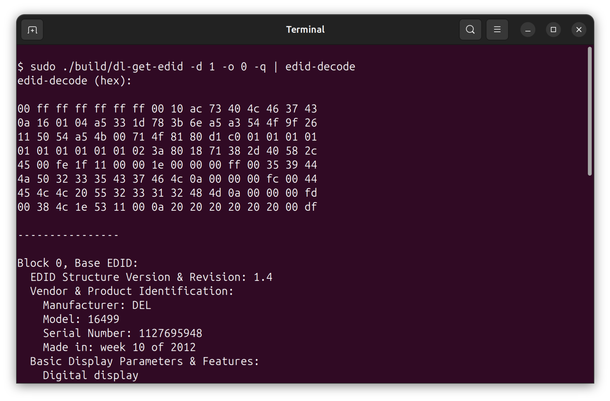

# Read EDID



## Overview

The Read EDID sample demonstrates how to use the DisplayLink Direct API to
retrieve Extended Display Identification Data (EDID) from connected DisplayLink
displays. EDID is data stored in each monitor that identifies the display's
vendor, model, supported resolutions, refresh rates, color capabilities, and
other characteristics. This sample shows how to access the data through the DP
AUX (DisplayPort Auxiliary) channel.

!!! warning "Chip Family Compatibility"
    This sample is compatible only with **DL-7xxx-family** DisplayLink devices.

## EDID Details

EDID (Extended Display Identification Data) is a standard that contains:

- Vendor ID and product information.
- Supported display resolutions and refresh rates.
- Color depth capabilities.
- Timing information and video modes.
- Display connector type.
- Serial number and model name.

This information helps applications and systems understand what a display can do and configure themselves accordingly.

## Source Code

The complete implementation of the Read EDID sample is available in [samples/dl-get-edid/dl-get-edid.cpp]({{ config.repo_url }}/blob/{{ main_branch }}/samples/dl-get-edid/dl-get-edid.cpp).

## Building and Running

### Prerequisites

- DisplayLink Direct installed.
- CMake 3.10 or higher.
- C++17-compatible compiler.

### Build Instructions

Navigate to the samples directory and build using CMake:

```bash
# CMAKE_PREFIX_PATH should point to dlsdk directory with libs/, firmware/, include/
# e.g. to root of this repository
cd samples/dl-get-edid
cmake -DCMAKE_PREFIX_PATH=../../ -S . -B build
cmake --build build
```

### Running the Application

Run the dl-get-edid application to read EDID data:

```bash
# Read EDID from the first device, first output
./build/dl-get-edid

# Read EDID from a specific device and output
./build/dl-get-edid -d 0 -o 0

# Read EDID with quiet mode (no status messages)
./build/dl-get-edid -d 1 -o 2 -q

# Display help information
./build/dl-get-edid -h
```

### Parameters

- **-d \<device\>**: Device number to query (default: 0). Use 0 through
  device count minus 1.
- **-o \<output\>**: Output/display number on the device (default: 0). Use 0
  through output count minus 1.
- **-q**: Quiet mode—suppresses status messages and is useful for scripting.
- **-h**: Displays the help message.

### Output

The application prints the raw EDID binary data to standard output. The EDID
data is typically 128 bytes (or 256 bytes for extended EDID) and can be:

- Redirected to a file for analysis.
- Parsed by external tools to extract display information.
- Used in system configuration scripts.

### Notes

- All connected monitors must be powered on to read their EDID.
- Use Ctrl+C to exit the application.
- Various online tools and specifications are available for parsing and
  analyzing EDID data.
- On Ubuntu systems, you can install and use the `read-edid` package to decode the EDID data:
  ```bash
  sudo apt-get install read-edid
  ./build/dl-get-edid -q | parse-edid
  ```
