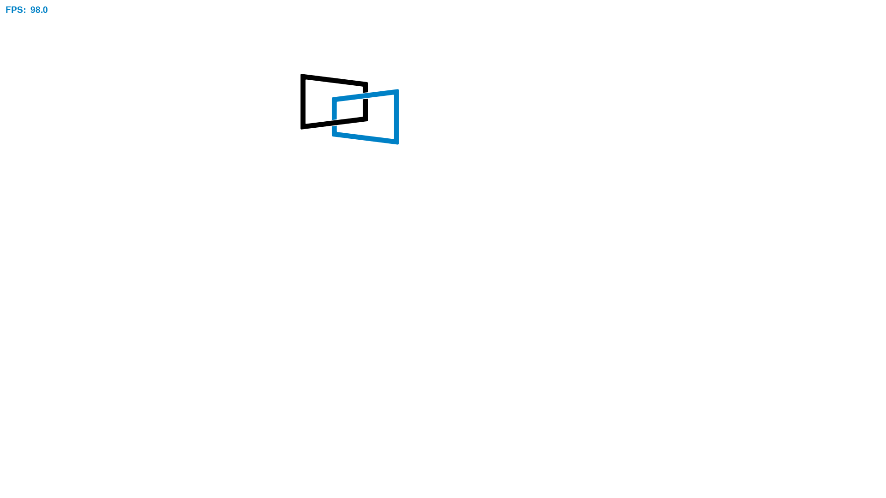

# Screensaver

{ .sample-screenshot-frame }

## Overview

The Screensaver sample demonstrates how to use the DisplayLink Direct Python bindings to render animated content on a connected display. The app uses PySDL2 to render a bouncing DisplayLink logo and streams each frame to the device using the DisplayLink Direct Python module.

This sample is useful for validating end-to-end Python rendering performance, checking display connectivity, and learning how to push RGB frame buffers from Python.

## Source Code

The complete implementation of the Screensaver sample is available in [samples/screensaver/screensaver.py]({{ config.repo_url }}/blob/{{ main_branch }}/samples/screensaver/screensaver.py).

## Prerequisites

- DisplayLink Direct Python wheel installed (from the `python/` directory in this repository).
- Python 3.10 or later.

## Setup and Running

Create a virtual environment and install dependencies:

```bash
cd samples/screensaver
python3 -m venv .venv
source .venv/bin/activate
pip install -r requirements.txt
```

Run the sample:

```bash
python screensaver.py
```

## Runtime Behavior

- Initializes DisplayLink Direct with a default configuration.
- Asserts exactly one connected device and one connected display.
- Powers on the display and queries the display resolution.
- Renders a bouncing DisplayLink logo on a white background.
- Displays the real-time frame rate in frames per second (FPS).
- Streams frames continuously until you press `q`, press `Esc`, close the app
  window, or press `Ctrl+C`.

## Notes

- The sample uses double buffering to avoid tearing while frames are submitted.
- If the app cannot access the USB device, configure udev permissions as described in the [samples/README.md]({{ config.repo_url }}/blob/{{ main_branch }}/samples/README.md).
