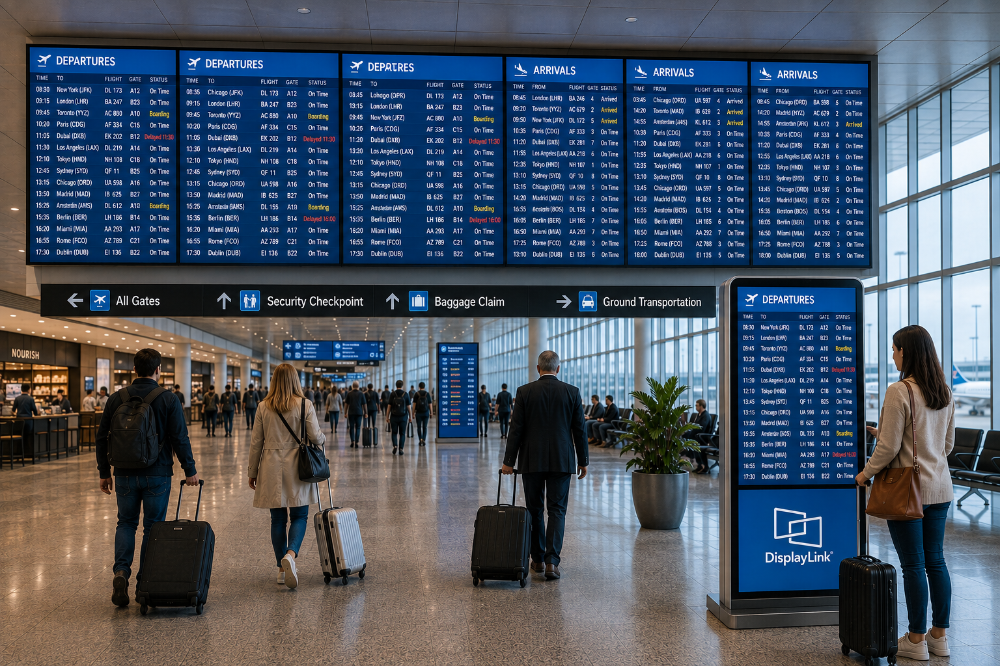

# Video Clone



## Overview

The Video Clone sample demonstrates how to use the DisplayLink Direct API to
display identical content simultaneously across all connected DisplayLink
displays. It is intended for situations in which the same image or video must
appear on every display without spanning or tiling.

## Key Features

- **Synchronized display**: Shows identical content on all connected monitors simultaneously.
- **Multi-device support**: Manages multiple DisplayLink devices with unified playback control.
- **Real-time rendering**: Delivers consistent frame rates across all displays.
- **Flexible media support**: Plays both images and video files in various formats.

## Use Cases

- **Presentation displays**: Show the same content to multiple audiences simultaneously.
- **Retail environments**: Display promotions or information on multiple screens at once.
- **Meeting rooms**: Mirror content across all wall-mounted displays.
- **Information kiosks**: Provide consistent information across multiple display locations.

## Source Code

The complete implementation of the Video Clone sample is available in [samples/video/video-clone.cpp]({{ config.repo_url }}/blob/{{ main_branch }}/samples/video/video-clone.cpp).

## Building and Running

### Prerequisites

- DisplayLink Direct installed.
- CMake 3.10 or higher.
- C++17-compatible compiler.
- VLC or GStreamer libraries for media playback.

### Ubuntu Dependencies

Install dependencies for one backend (VLC or GStreamer), depending on how you want to build:

```bash
# Common build tools
sudo apt update
sudo apt install -y build-essential cmake pkg-config

# VLC backend dependencies (default)
sudo apt install -y libvlc-dev

# GStreamer backend dependencies (optional)
sudo apt install -y \
	libgstreamer1.0-dev \
	libgstreamer-plugins-base1.0-dev \
	gstreamer1.0-plugins-base \
	gstreamer1.0-plugins-good \
	gstreamer1.0-plugins-bad \
	gstreamer1.0-libav
```

### Build Instructions

Navigate to the sample directory and build using CMake:

```bash
# CMAKE_PREFIX_PATH should point to dlsdk directory with libs/, firmware/, include/
# e.g. to root of this repository
cd samples/video

# Build with VLC backend (default)
cmake -DCMAKE_PREFIX_PATH=../.. -S . -B build
cmake --build build

# Build with GStreamer backend
cmake -DCMAKE_PREFIX_PATH=../.. -DUSE_GSTREAMER=ON -S . -B build-gst
cmake --build build-gst
```

### Running the Application

Run the video-clone application with an image or video file:

```bash
# Display a single image on all connected monitors
./build/video-clone /path/to/image.png

# Display with rotation
./build/video-clone /path/to/image.png rotate

# Display with timeout (in seconds)
./build/video-clone /path/to/video.mp4 rotate 30

# If you built the GStreamer backend
./build-gst/video-clone /path/to/video.mp4 rotate 30
```

### Parameters

- **filename** (required): Path to the image or video file to display.
- **rotate** (optional): Add this parameter to enable rotation of the content.
- **timeout** (optional): Duration in seconds to run the application. If omitted, press Enter to exit.

### Notes

- All monitors must have the same resolution for proper alignment.
- The same frame is sent to all connected displays simultaneously.
- Use Ctrl+C or the specified timeout to exit the application gracefully.
- Audio is not supported in this sample.
