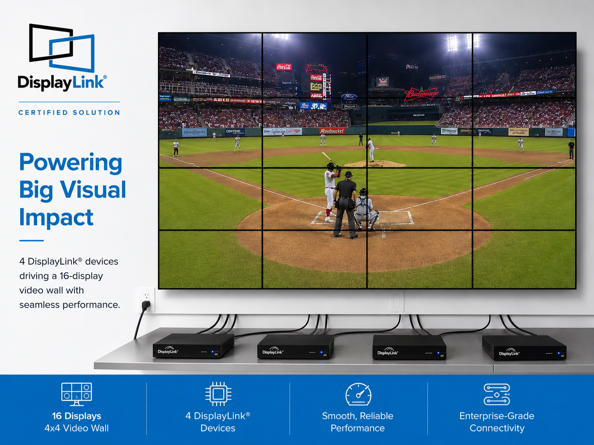

# Video Wall


## Overview

The Video Wall sample demonstrates how to use the DisplayLink Direct API to
create a video wall by distributing a single image or video stream across
multiple connected DisplayLink displays. It supports applications such as
digital signage, control centers, and entertainment venues.

## Source Code

The complete implementation of the Video Wall sample is available in [samples/video/video-wall.cpp]({{ config.repo_url }}/blob/{{ main_branch }}/samples/video/video-wall.cpp).

## Building and Running

### Prerequisites

- DisplayLink Direct installed.
- CMake 3.10 or higher.
- C++17-compatible compiler.
- VLC or GStreamer libraries for media playback.

### Ubuntu Dependencies

Install dependencies for one backend (VLC or GStreamer), depending on how you want to build:

```bash
# Common build tools
sudo apt update
sudo apt install -y build-essential cmake pkg-config

# VLC backend dependencies (default)
sudo apt install -y libvlc-dev

# GStreamer backend dependencies (optional)
sudo apt install -y \
	libgstreamer1.0-dev \
	libgstreamer-plugins-base1.0-dev \
	gstreamer1.0-plugins-base \
	gstreamer1.0-plugins-good \
	gstreamer1.0-plugins-bad \
	gstreamer1.0-libav
```

### Build Instructions

Navigate to the sample directory and build using CMake:

```bash
# CMAKE_PREFIX_PATH should point to dlsdk directory with libs/, firmware/, include/
# e.g. to root of this repository
cd samples/video

# Build with VLC backend (default)
cmake -DCMAKE_PREFIX_PATH=../.. -S . -B build
cmake --build build

# Build with GStreamer backend
cmake -DCMAKE_PREFIX_PATH=../.. -DUSE_GSTREAMER=ON -S . -B build-gst
cmake --build build-gst

```

### Running the Application

Run the video-wall application with an image or video file:

```bash
# Display a single image across all connected monitors
./build/video-wall /path/to/image.png

# Display with rotation
./build/video-wall /path/to/image.png rotate

# Display with timeout (in seconds)
./build/video-wall /path/to/video.mp4 rotate 30

# If you built the GStreamer backend
./build-gst/video-wall /path/to/video.mp4 rotate 30
```

### Parameters

- **filename** (required): Path to the image or video file to display.
- **rotate** (optional): Add this parameter to enable rotation of the content.
- **timeout** (optional): Duration in seconds to run the application. If omitted, press Enter to exit.

### Notes

- The application supports 2 × 2 layouts (four displays) or linear arrangements (any number of displays).
- All monitors must have the same resolution for proper alignment.
- Use Ctrl+C or the specified timeout to exit the application gracefully.
